# Projects and dependencies analysis

This document provides a comprehensive overview of the projects and their dependencies in the context of upgrading to .NETCoreApp,Version=v10.0.

## Table of Contents

- [Executive Summary](#executive-Summary)
  - [Highlevel Metrics](#highlevel-metrics)
  - [Projects Compatibility](#projects-compatibility)
  - [Package Compatibility](#package-compatibility)
  - [API Compatibility](#api-compatibility)
- [Aggregate NuGet packages details](#aggregate-nuget-packages-details)
- [Top API Migration Challenges](#top-api-migration-challenges)
  - [Technologies and Features](#technologies-and-features)
  - [Most Frequent API Issues](#most-frequent-api-issues)
- [Projects Relationship Graph](#projects-relationship-graph)
- [Project Details](#project-details)

  - [GraphQLClient\GraphQLClient.csproj](#graphqlclientgraphqlclientcsproj)
  - [GraphQLServer\GraphQLServer.csproj](#graphqlservergraphqlservercsproj)
  - [GRPCClient\GRPCClient.csproj](#grpcclientgrpcclientcsproj)
  - [GRPCServer\GRPCServer.csproj](#grpcservergrpcservercsproj)
  - [MQTTClient\MQTTClient.csproj](#mqttclientmqttclientcsproj)
  - [MQTTServer\MQTTServer.csproj](#mqttservermqttservercsproj)
  - [Protocols.Common\Protocols.Common.csproj](#protocolscommonprotocolscommoncsproj)
  - [RESTClient\RESTClient.csproj](#restclientrestclientcsproj)
  - [RESTServer\RESTServer.csproj](#restserverrestservercsproj)
  - [SOAPServer\SOAPServer.csproj](#soapserversoapservercsproj)
  - [WebhookSender\WebhookSender.csproj](#webhooksenderwebhooksendercsproj)
  - [WebSocketClient\WebSocketClient.csproj](#websocketclientwebsocketclientcsproj)
  - [WebSocketServer\WebSocketServer.csproj](#websocketserverwebsocketservercsproj)

## Executive Summary

### Highlevel Metrics

| Metric | Count | Status |
| :--- | :---: | :--- |
| Total Projects | 13 | All require upgrade |
| Total NuGet Packages | 14 | 3 need upgrade |
| Total Code Files | 54 |  |
| Total Code Files with Incidents | 16 |  |
| Total Lines of Code | 1585 |  |
| Total Number of Issues | 29 |  |
| Estimated LOC to modify | 6+ | at least 0,4% of codebase |

### Projects Compatibility

| Project | Target Framework | Difficulty | Package Issues | API Issues | Est. LOC Impact | Description |
| :--- | :---: | :---: | :---: | :---: | :---: | :--- |
| [GraphQLClient\GraphQLClient.csproj](#graphqlclientgraphqlclientcsproj) | net7.0 | 🟢 Low | 0 | 1 | 1+ | AspNetCore, Sdk Style = True |
| [GraphQLServer\GraphQLServer.csproj](#graphqlservergraphqlservercsproj) | net7.0 | 🟢 Low | 1 | 0 |  | AspNetCore, Sdk Style = True |
| [GRPCClient\GRPCClient.csproj](#grpcclientgrpcclientcsproj) | net7.0 | 🟢 Low | 0 | 0 |  | DotNetCoreApp, Sdk Style = True |
| [GRPCServer\GRPCServer.csproj](#grpcservergrpcservercsproj) | net7.0 | 🟢 Low | 0 | 0 |  | AspNetCore, Sdk Style = True |
| [MQTTClient\MQTTClient.csproj](#mqttclientmqttclientcsproj) | net7.0 | 🟢 Low | 0 | 0 |  | DotNetCoreApp, Sdk Style = True |
| [MQTTServer\MQTTServer.csproj](#mqttservermqttservercsproj) | net7.0 | 🟢 Low | 1 | 0 |  | DotNetCoreApp, Sdk Style = True |
| [Protocols.Common\Protocols.Common.csproj](#protocolscommonprotocolscommoncsproj) | net7.0 | 🟢 Low | 1 | 0 |  | ClassLibrary, Sdk Style = True |
| [RESTClient\RESTClient.csproj](#restclientrestclientcsproj) | net7.0 | 🟢 Low | 1 | 1 | 1+ | AspNetCore, Sdk Style = True |
| [RESTServer\RESTServer.csproj](#restserverrestservercsproj) | net7.0 | 🟢 Low | 2 | 0 |  | AspNetCore, Sdk Style = True |
| [SOAPServer\SOAPServer.csproj](#soapserversoapservercsproj) | net7.0 | 🟢 Low | 2 | 4 | 4+ | AspNetCore, Sdk Style = True |
| [WebhookSender\WebhookSender.csproj](#webhooksenderwebhooksendercsproj) | net7.0 | 🟢 Low | 0 | 0 |  | DotNetCoreApp, Sdk Style = True |
| [WebSocketClient\WebSocketClient.csproj](#websocketclientwebsocketclientcsproj) | net7.0 | 🟢 Low | 0 | 0 |  | AspNetCore, Sdk Style = True |
| [WebSocketServer\WebSocketServer.csproj](#websocketserverwebsocketservercsproj) | net7.0 | 🟢 Low | 1 | 0 |  | AspNetCore, Sdk Style = True |

### Package Compatibility

| Status | Count | Percentage |
| :--- | :---: | :---: |
| ✅ Compatible | 11 | 78,6% |
| ⚠️ Incompatible | 0 | 0,0% |
| 🔄 Upgrade Recommended | 3 | 21,4% |
| ***Total NuGet Packages*** | ***14*** | ***100%*** |

### API Compatibility

| Category | Count | Impact |
| :--- | :---: | :--- |
| 🔴 Binary Incompatible | 0 | High - Require code changes |
| 🟡 Source Incompatible | 4 | Medium - Needs re-compilation and potential conflicting API error fixing |
| 🔵 Behavioral change | 2 | Low - Behavioral changes that may require testing at runtime |
| ✅ Compatible | 5895 |  |
| ***Total APIs Analyzed*** | ***5901*** |  |

## Aggregate NuGet packages details

| Package | Current Version | Suggested Version | Projects | Description |
| :--- | :---: | :---: | :--- | :--- |
| Google.Protobuf | 3.24.4 |  | [GRPCClient.csproj](#grpcclientgrpcclientcsproj) | ✅Compatible |
| Grpc.AspNetCore | 2.49.0 |  | [GRPCServer.csproj](#grpcservergrpcservercsproj) | ✅Compatible |
| Grpc.Net.Client | 2.57.0 |  | [GRPCClient.csproj](#grpcclientgrpcclientcsproj) | ✅Compatible |
| Grpc.Tools | 2.58.0 |  | [GRPCClient.csproj](#grpcclientgrpcclientcsproj) | ✅Compatible |
| HotChocolate | 13.5.1 |  | [GraphQLServer.csproj](#graphqlservergraphqlservercsproj) | ✅Compatible |
| HotChocolate.AspNetCore | 13.5.1 |  | [GraphQLServer.csproj](#graphqlservergraphqlservercsproj) | ✅Compatible |
| HotChocolate.AspNetCore.Voyager | 10.5.5 |  | [GraphQLServer.csproj](#graphqlservergraphqlservercsproj) | ✅Compatible |
| Microsoft.AspNetCore.OpenApi | 7.0.11 | 10.0.11 | [GraphQLServer.csproj](#graphqlservergraphqlservercsproj) [RESTServer.csproj](#restserverrestservercsproj) [SOAPServer.csproj](#soapserversoapservercsproj) [WebSocketServer.csproj](#websocketserverwebsocketservercsproj) | NuGet package upgrade is recommended |
| Microsoft.Extensions.Logging.Abstractions | 7.0.1 | 10.0.11 | [MQTTServer.csproj](#mqttservermqttservercsproj) | NuGet package upgrade is recommended |
| MQTTnet | 4.3.1.873 |  | [MQTTClient.csproj](#mqttclientmqttclientcsproj) [MQTTServer.csproj](#mqttservermqttservercsproj) | ✅Compatible |
| Newtonsoft.Json | 13.0.3 | 13.0.4 | [Protocols.Common.csproj](#protocolscommonprotocolscommoncsproj) [RESTClient.csproj](#restclientrestclientcsproj) [RESTServer.csproj](#restserverrestservercsproj) | NuGet package upgrade is recommended |
| SoapCore | 1.1.0.39 |  | [SOAPServer.csproj](#soapserversoapservercsproj) | ✅Compatible |
| Swashbuckle.AspNetCore | 6.5.0 |  | [GraphQLServer.csproj](#graphqlservergraphqlservercsproj) [RESTServer.csproj](#restserverrestservercsproj) [SOAPServer.csproj](#soapserversoapservercsproj) [WebSocketServer.csproj](#websocketserverwebsocketservercsproj) | ✅Compatible |
| System.ServiceModel.Primitives | 6.0.0 |  | [SOAPServer.csproj](#soapserversoapservercsproj) | Needs to be replaced with Replace with new package CoreWCF.Primitives=1.9.1;CoreWCF.ConfigurationManager=1.9.1;CoreWCF.Http=1.9.1;CoreWCF.WebHttp=1.9.1;CoreWCF.NetTcp=1.9.1 |

## Top API Migration Challenges

### Technologies and Features

| Technology | Issues | Percentage | Migration Path |
| :--- | :---: | :---: | :--- |
| WCF Client APIs | 4 | 66,7% | WCF client-side APIs for building service clients that communicate with WCF services. These APIs are available as exact equivalents via NuGet packages - add System.ServiceModel.* NuGet packages (System.ServiceModel.Http, System.ServiceModel.Primitives, System.ServiceModel.NetTcp, etc.) |

### Most Frequent API Issues

| API | Count | Percentage | Category |
| :--- | :---: | :---: | :--- |
| M:Microsoft.AspNetCore.Builder.ExceptionHandlerExtensions.UseExceptionHandler(Microsoft.AspNetCore.Builder.IApplicationBuilder,System.String) | 1 | 16,7% | Behavioral Change |
| T:System.Net.Http.HttpContent | 1 | 16,7% | Behavioral Change |
| M:System.ServiceModel.ServiceContractAttribute.#ctor | 1 | 16,7% | Source Incompatible |
| T:System.ServiceModel.ServiceContractAttribute | 1 | 16,7% | Source Incompatible |
| M:System.ServiceModel.OperationContractAttribute.#ctor | 1 | 16,7% | Source Incompatible |
| T:System.ServiceModel.OperationContractAttribute | 1 | 16,7% | Source Incompatible |

## Projects Relationship Graph

Legend:
📦 SDK-style project
⚙️ Classic project

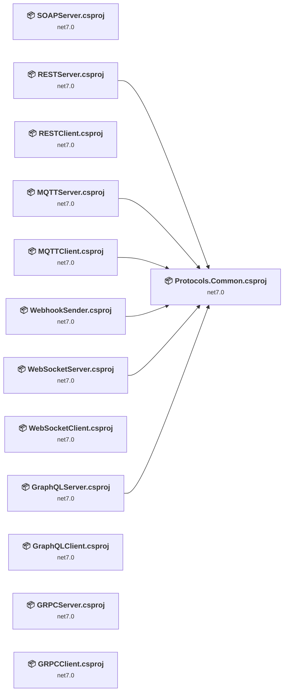

## Project Details

### GraphQLClient\GraphQLClient.csproj

#### Project Info

- **Current Target Framework:** net7.0
- **Proposed Target Framework:** net10.0
- **SDK-style**: True
- **Project Kind:** AspNetCore
- **Dependencies**: 0
- **Dependants**: 0
- **Number of Files**: 12
- **Number of Files with Incidents**: 2
- **Lines of Code**: 171
- **Estimated LOC to modify**: 1+ (at least 0,6% of the project)

#### Dependency Graph

Legend:
📦 SDK-style project
⚙️ Classic project

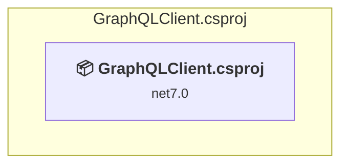

### API Compatibility

| Category | Count | Impact |
| :--- | :---: | :--- |
| 🔴 Binary Incompatible | 0 | High - Require code changes |
| 🟡 Source Incompatible | 0 | Medium - Needs re-compilation and potential conflicting API error fixing |
| 🔵 Behavioral change | 1 | Low - Behavioral changes that may require testing at runtime |
| ✅ Compatible | 796 |  |
| ***Total APIs Analyzed*** | ***797*** |  |

### GraphQLServer\GraphQLServer.csproj

#### Project Info

- **Current Target Framework:** net7.0
- **Proposed Target Framework:** net10.0
- **SDK-style**: True
- **Project Kind:** AspNetCore
- **Dependencies**: 1
- **Dependants**: 0
- **Number of Files**: 4
- **Number of Files with Incidents**: 1
- **Lines of Code**: 96
- **Estimated LOC to modify**: 0+ (at least 0,0% of the project)

#### Dependency Graph

Legend:
📦 SDK-style project
⚙️ Classic project

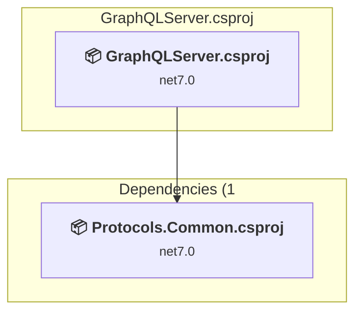

### API Compatibility

| Category | Count | Impact |
| :--- | :---: | :--- |
| 🔴 Binary Incompatible | 0 | High - Require code changes |
| 🟡 Source Incompatible | 0 | Medium - Needs re-compilation and potential conflicting API error fixing |
| 🔵 Behavioral change | 0 | Low - Behavioral changes that may require testing at runtime |
| ✅ Compatible | 127 |  |
| ***Total APIs Analyzed*** | ***127*** |  |

### GRPCClient\GRPCClient.csproj

#### Project Info

- **Current Target Framework:** net7.0
- **Proposed Target Framework:** net10.0
- **SDK-style**: True
- **Project Kind:** DotNetCoreApp
- **Dependencies**: 0
- **Dependants**: 0
- **Number of Files**: 1
- **Number of Files with Incidents**: 1
- **Lines of Code**: 16
- **Estimated LOC to modify**: 0+ (at least 0,0% of the project)

#### Dependency Graph

Legend:
📦 SDK-style project
⚙️ Classic project

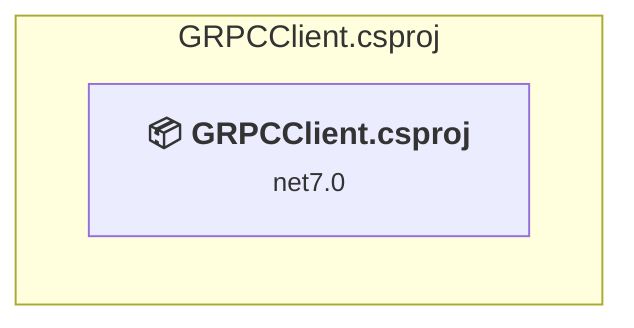

### API Compatibility

| Category | Count | Impact |
| :--- | :---: | :--- |
| 🔴 Binary Incompatible | 0 | High - Require code changes |
| 🟡 Source Incompatible | 0 | Medium - Needs re-compilation and potential conflicting API error fixing |
| 🔵 Behavioral change | 0 | Low - Behavioral changes that may require testing at runtime |
| ✅ Compatible | 841 |  |
| ***Total APIs Analyzed*** | ***841*** |  |

### GRPCServer\GRPCServer.csproj

#### Project Info

- **Current Target Framework:** net7.0
- **Proposed Target Framework:** net10.0
- **SDK-style**: True
- **Project Kind:** AspNetCore
- **Dependencies**: 0
- **Dependants**: 0
- **Number of Files**: 5
- **Number of Files with Incidents**: 1
- **Lines of Code**: 64
- **Estimated LOC to modify**: 0+ (at least 0,0% of the project)

#### Dependency Graph

Legend:
📦 SDK-style project
⚙️ Classic project

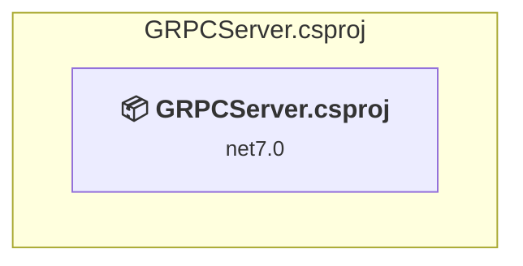

### API Compatibility

| Category | Count | Impact |
| :--- | :---: | :--- |
| 🔴 Binary Incompatible | 0 | High - Require code changes |
| 🟡 Source Incompatible | 0 | Medium - Needs re-compilation and potential conflicting API error fixing |
| 🔵 Behavioral change | 0 | Low - Behavioral changes that may require testing at runtime |
| ✅ Compatible | 898 |  |
| ***Total APIs Analyzed*** | ***898*** |  |

### MQTTClient\MQTTClient.csproj

#### Project Info

- **Current Target Framework:** net7.0
- **Proposed Target Framework:** net10.0
- **SDK-style**: True
- **Project Kind:** DotNetCoreApp
- **Dependencies**: 1
- **Dependants**: 0
- **Number of Files**: 2
- **Number of Files with Incidents**: 1
- **Lines of Code**: 84
- **Estimated LOC to modify**: 0+ (at least 0,0% of the project)

#### Dependency Graph

Legend:
📦 SDK-style project
⚙️ Classic project

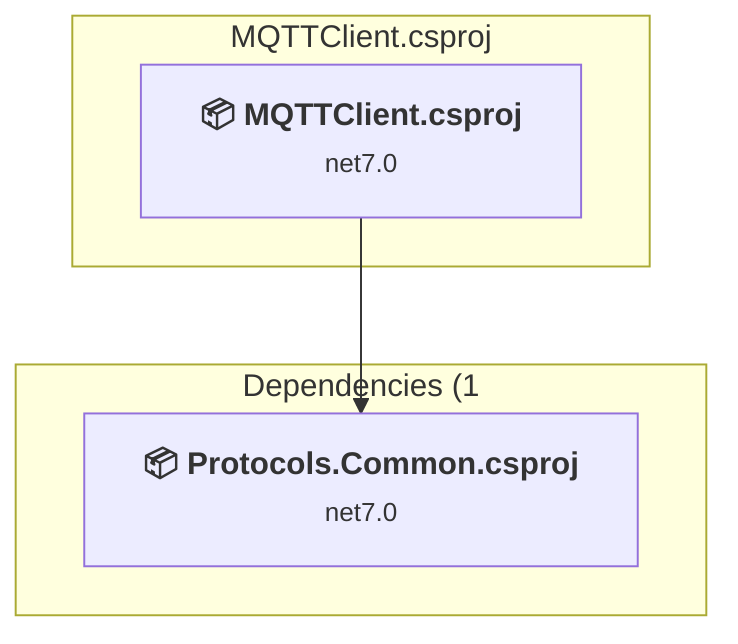

### API Compatibility

| Category | Count | Impact |
| :--- | :---: | :--- |
| 🔴 Binary Incompatible | 0 | High - Require code changes |
| 🟡 Source Incompatible | 0 | Medium - Needs re-compilation and potential conflicting API error fixing |
| 🔵 Behavioral change | 0 | Low - Behavioral changes that may require testing at runtime |
| ✅ Compatible | 132 |  |
| ***Total APIs Analyzed*** | ***132*** |  |

### MQTTServer\MQTTServer.csproj

#### Project Info

- **Current Target Framework:** net7.0
- **Proposed Target Framework:** net10.0
- **SDK-style**: True
- **Project Kind:** DotNetCoreApp
- **Dependencies**: 1
- **Dependants**: 0
- **Number of Files**: 2
- **Number of Files with Incidents**: 1
- **Lines of Code**: 53
- **Estimated LOC to modify**: 0+ (at least 0,0% of the project)

#### Dependency Graph

Legend:
📦 SDK-style project
⚙️ Classic project

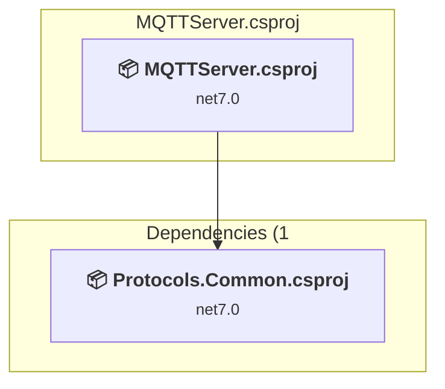

### API Compatibility

| Category | Count | Impact |
| :--- | :---: | :--- |
| 🔴 Binary Incompatible | 0 | High - Require code changes |
| 🟡 Source Incompatible | 0 | Medium - Needs re-compilation and potential conflicting API error fixing |
| 🔵 Behavioral change | 0 | Low - Behavioral changes that may require testing at runtime |
| ✅ Compatible | 99 |  |
| ***Total APIs Analyzed*** | ***99*** |  |

### Protocols.Common\Protocols.Common.csproj

#### Project Info

- **Current Target Framework:** net7.0
- **Proposed Target Framework:** net10.0
- **SDK-style**: True
- **Project Kind:** ClassLibrary
- **Dependencies**: 0
- **Dependants**: 6
- **Number of Files**: 6
- **Number of Files with Incidents**: 1
- **Lines of Code**: 226
- **Estimated LOC to modify**: 0+ (at least 0,0% of the project)

#### Dependency Graph

Legend:
📦 SDK-style project
⚙️ Classic project

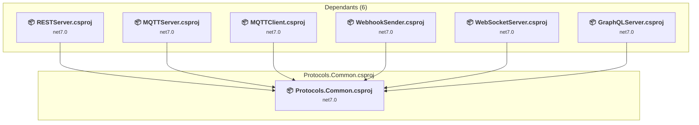

### API Compatibility

| Category | Count | Impact |
| :--- | :---: | :--- |
| 🔴 Binary Incompatible | 0 | High - Require code changes |
| 🟡 Source Incompatible | 0 | Medium - Needs re-compilation and potential conflicting API error fixing |
| 🔵 Behavioral change | 0 | Low - Behavioral changes that may require testing at runtime |
| ✅ Compatible | 138 |  |
| ***Total APIs Analyzed*** | ***138*** |  |

### RESTClient\RESTClient.csproj

#### Project Info

- **Current Target Framework:** net7.0
- **Proposed Target Framework:** net10.0
- **SDK-style**: True
- **Project Kind:** AspNetCore
- **Dependencies**: 0
- **Dependants**: 0
- **Number of Files**: 22
- **Number of Files with Incidents**: 2
- **Lines of Code**: 403
- **Estimated LOC to modify**: 1+ (at least 0,2% of the project)

#### Dependency Graph

Legend:
📦 SDK-style project
⚙️ Classic project

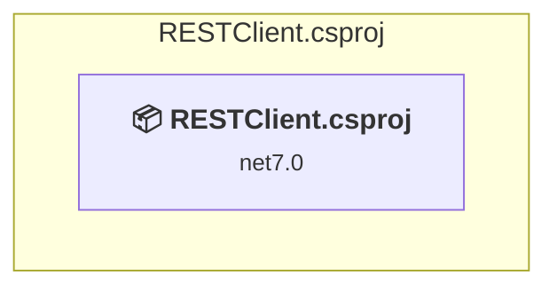

### API Compatibility

| Category | Count | Impact |
| :--- | :---: | :--- |
| 🔴 Binary Incompatible | 0 | High - Require code changes |
| 🟡 Source Incompatible | 0 | Medium - Needs re-compilation and potential conflicting API error fixing |
| 🔵 Behavioral change | 1 | Low - Behavioral changes that may require testing at runtime |
| ✅ Compatible | 1535 |  |
| ***Total APIs Analyzed*** | ***1536*** |  |

### RESTServer\RESTServer.csproj

#### Project Info

- **Current Target Framework:** net7.0
- **Proposed Target Framework:** net10.0
- **SDK-style**: True
- **Project Kind:** AspNetCore
- **Dependencies**: 1
- **Dependants**: 0
- **Number of Files**: 3
- **Number of Files with Incidents**: 1
- **Lines of Code**: 83
- **Estimated LOC to modify**: 0+ (at least 0,0% of the project)

#### Dependency Graph

Legend:
📦 SDK-style project
⚙️ Classic project

### API Compatibility

| Category | Count | Impact |
| :--- | :---: | :--- |
| 🔴 Binary Incompatible | 0 | High - Require code changes |
| 🟡 Source Incompatible | 0 | Medium - Needs re-compilation and potential conflicting API error fixing |
| 🔵 Behavioral change | 0 | Low - Behavioral changes that may require testing at runtime |
| ✅ Compatible | 141 |  |
| ***Total APIs Analyzed*** | ***141*** |  |

### SOAPServer\SOAPServer.csproj

#### Project Info

- **Current Target Framework:** net7.0
- **Proposed Target Framework:** net10.0
- **SDK-style**: True
- **Project Kind:** AspNetCore
- **Dependencies**: 0
- **Dependants**: 0
- **Number of Files**: 6
- **Number of Files with Incidents**: 2
- **Lines of Code**: 96
- **Estimated LOC to modify**: 4+ (at least 4,2% of the project)

#### Dependency Graph

Legend:
📦 SDK-style project
⚙️ Classic project

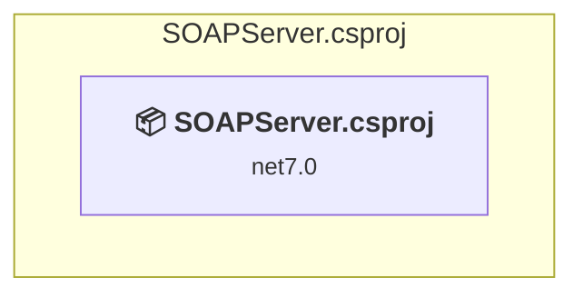

### API Compatibility

| Category | Count | Impact |
| :--- | :---: | :--- |
| 🔴 Binary Incompatible | 0 | High - Require code changes |
| 🟡 Source Incompatible | 4 | Medium - Needs re-compilation and potential conflicting API error fixing |
| 🔵 Behavioral change | 0 | Low - Behavioral changes that may require testing at runtime |
| ✅ Compatible | 136 |  |
| ***Total APIs Analyzed*** | ***140*** |  |

#### Project Technologies and Features

| Technology | Issues | Percentage | Migration Path |
| :--- | :---: | :---: | :--- |
| WCF Client APIs | 4 | 100,0% | WCF client-side APIs for building service clients that communicate with WCF services. These APIs are available as exact equivalents via NuGet packages - add System.ServiceModel.* NuGet packages (System.ServiceModel.Http, System.ServiceModel.Primitives, System.ServiceModel.NetTcp, etc.) |

### WebhookSender\WebhookSender.csproj

#### Project Info

- **Current Target Framework:** net7.0
- **Proposed Target Framework:** net10.0
- **SDK-style**: True
- **Project Kind:** DotNetCoreApp
- **Dependencies**: 1
- **Dependants**: 0
- **Number of Files**: 1
- **Number of Files with Incidents**: 1
- **Lines of Code**: 62
- **Estimated LOC to modify**: 0+ (at least 0,0% of the project)

#### Dependency Graph

Legend:
📦 SDK-style project
⚙️ Classic project

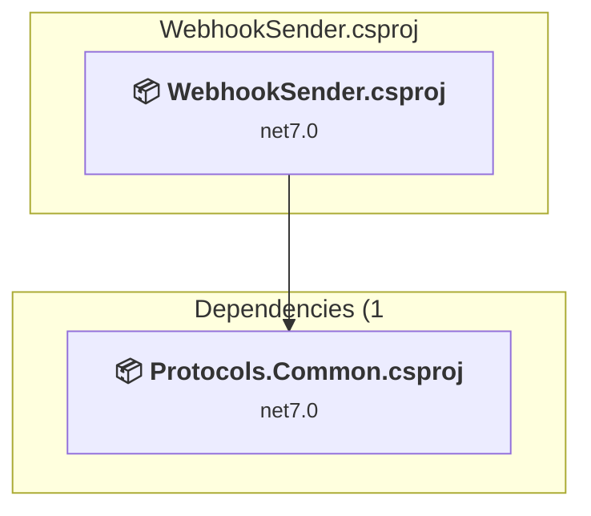

### API Compatibility

| Category | Count | Impact |
| :--- | :---: | :--- |
| 🔴 Binary Incompatible | 0 | High - Require code changes |
| 🟡 Source Incompatible | 0 | Medium - Needs re-compilation and potential conflicting API error fixing |
| 🔵 Behavioral change | 0 | Low - Behavioral changes that may require testing at runtime |
| ✅ Compatible | 87 |  |
| ***Total APIs Analyzed*** | ***87*** |  |

### WebSocketClient\WebSocketClient.csproj

#### Project Info

- **Current Target Framework:** net7.0
- **Proposed Target Framework:** net10.0
- **SDK-style**: True
- **Project Kind:** AspNetCore
- **Dependencies**: 0
- **Dependants**: 0
- **Number of Files**: 12
- **Number of Files with Incidents**: 1
- **Lines of Code**: 149
- **Estimated LOC to modify**: 0+ (at least 0,0% of the project)

#### Dependency Graph

Legend:
📦 SDK-style project
⚙️ Classic project

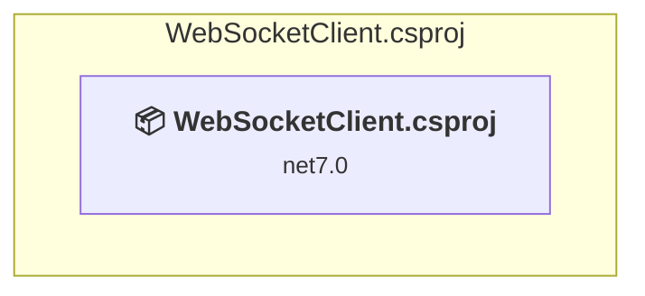

### API Compatibility

| Category | Count | Impact |
| :--- | :---: | :--- |
| 🔴 Binary Incompatible | 0 | High - Require code changes |
| 🟡 Source Incompatible | 0 | Medium - Needs re-compilation and potential conflicting API error fixing |
| 🔵 Behavioral change | 0 | Low - Behavioral changes that may require testing at runtime |
| ✅ Compatible | 843 |  |
| ***Total APIs Analyzed*** | ***843*** |  |

### WebSocketServer\WebSocketServer.csproj

#### Project Info

- **Current Target Framework:** net7.0
- **Proposed Target Framework:** net10.0
- **SDK-style**: True
- **Project Kind:** AspNetCore
- **Dependencies**: 1
- **Dependants**: 0
- **Number of Files**: 3
- **Number of Files with Incidents**: 1
- **Lines of Code**: 82
- **Estimated LOC to modify**: 0+ (at least 0,0% of the project)

#### Dependency Graph

Legend:
📦 SDK-style project
⚙️ Classic project

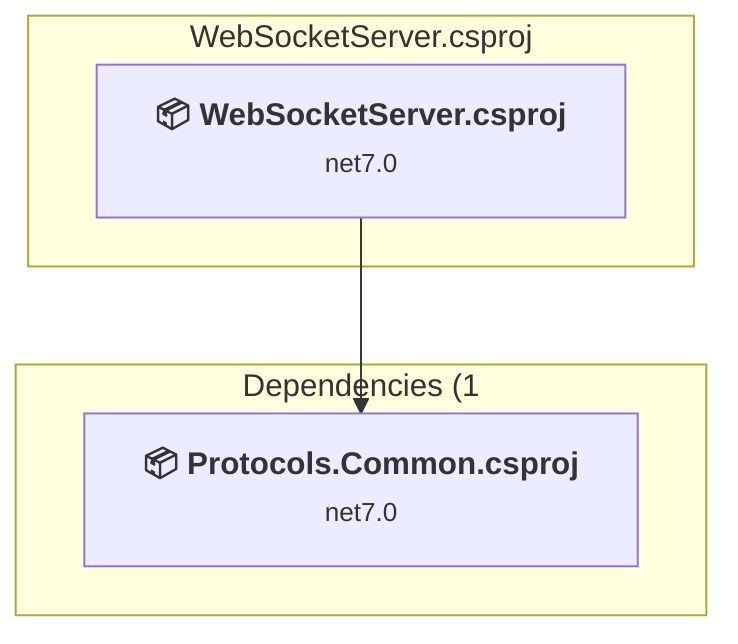

### API Compatibility

| Category | Count | Impact |
| :--- | :---: | :--- |
| 🔴 Binary Incompatible | 0 | High - Require code changes |
| 🟡 Source Incompatible | 0 | Medium - Needs re-compilation and potential conflicting API error fixing |
| 🔵 Behavioral change | 0 | Low - Behavioral changes that may require testing at runtime |
| ✅ Compatible | 122 |  |
| ***Total APIs Analyzed*** | ***122*** |  |

